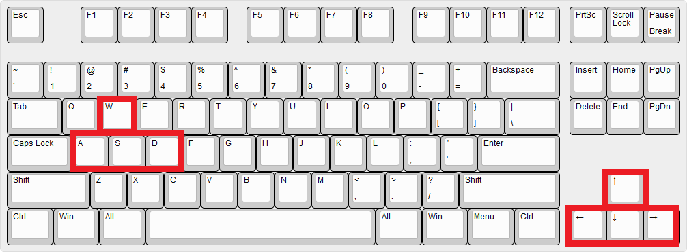
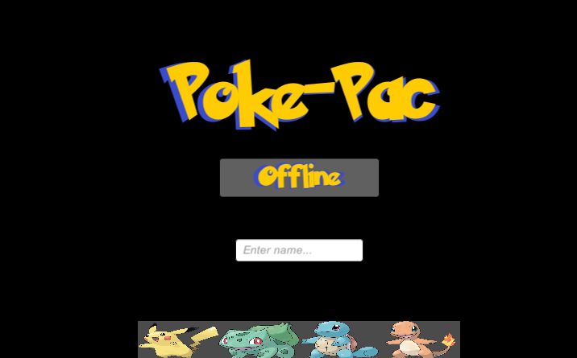
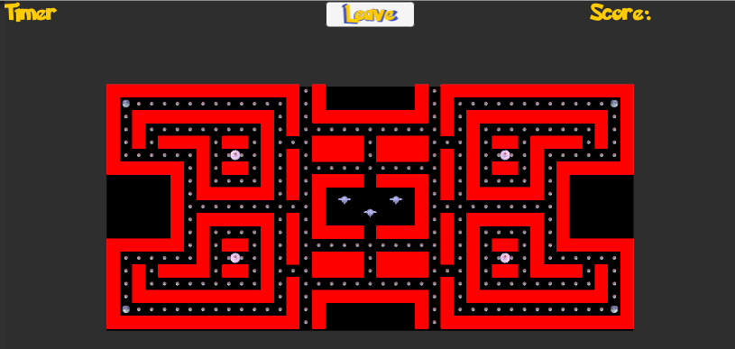

# Personal Information
COMP476 Assignment #3: Advanced Game Development, Concordia University    
Presented by: Thomas Backs    
ID: 27554524    

## Introduction
Multiplayer game inspired from the classic Pac-Man Battle Royale, but in my version, it will be with Pokemon instead. Each player controls a single pokemon (*Bulbasaur, Charmander, Squirtle, or Pikachu*), the players are trying to catch all PokeBall around the map, there is some Gengar's that are trying to catch these pokemon running around, try to not get caught by it! There is 4 Masterballs around the map as well, upon capturing a masterball, the Gengar will turn white and will try to run away from the players. In order to start playing it, you run it, wait for the Offline button to display Start, enter your name, click on your preferred pokemon character and then click on Start. It will automatically find opponents *(up to four (4))* and start the game after 5 seconds. Big thanks to InfoGamer for its video on how to use Photon Networking *(source below)*    

## Control and UI    

The keyboard control mapping for our Pokemon are arrow key or WASD, `W = up`, `A = left`, `S = down`, and `D = right`. These are the standard movement in gaming. The UI representation is pretty simple and minimalist, on top right you have your score displayed there which will be incremented each time your Pokemon eats a Pokeball and decremented by 10 each time you are killed by a Gengar. On top left, we have a timer that will be always decreasing until it reaches to zero which mean the game is over and the winner will be shown on the bottom of the screen. There is a button on middle-top written "Leave" which upon clicking it, will leave the current game and return to lobby.    

### Offline lobby and character selection screenshot

### in-game screenshot

## R1) Level Environment    
the environment is 2.5D style, with 3D assets. The path is one tile thick, the walls are represented by 1x1 cube. There is two warp tunnel at the each end of the map along the z-axis, it will warp the player to the other side. The same applies to our Gengar. The pac-dots on our path is represented as pokeball from Pokemon universe. There is 4 masterballs on our map at each corner, upon catching the masterball, it will turn Gengar into a different shade of color and allows our pokemon to kill them and send them back to prison.    

## R2) Basic Networked Multiplayer Pacman Game    
The network component that are being used in the project are Photo Engine, downloaded from Unity Assets store. It provides a lot of feature and host migration support as well, which is one of the main reason that I picked it. The Ghost used in the game are Gengar pokemons, its movement is accomplished by using `NavMesh` component provided by Unity 3D. The player move its pokemon by using the standard WASD key control.    
Player has spawning location at each corner of the map. This functionality is stored in **PokemonPlayer.cs** script file, how it works, it will simply get the Photon ID of the player and store it as integer: `int spawn_pos_pick = (PV.ViewID / 1000) - 1`, basically the ID of each player goes like this: 1000, 2000, 3000, 4000. so we divide it by 1000 and substract it by 1 to get its respective position. This is not a random feature, the position are fixed by the ID of each player that join the game.    

There is also a timer implemented shown at upper left corner of the map. It is sets to 4 minutes game, the game will end after 4 minutes. The game over condition will be implemented in the `GameSetup.cs` script.    

The pokeball will be reset once the map has been cleared out of it, meaning there is no more pokeball left in the game. Then it will re-enable the renderer as well the collider, in the function `MazeReset()` that been called from Update only if the call is from Master Client and the number of pokeball is below zero. The functions are stored in **GameSetup.cs** file.    

During the game, 4 PokePuffs will spawn every 35 seconds, it will allows the playe who touch it to reset the maze, respawning all eaten pokeballs and the game keeps going on until the timer reach zero. The PokePuff behaviour is stored in **PokePuffBehaviour.cs** file that is attached to PokePuff game object of the game.    

The winning condition implemented is a simple one, once the timer reach to zero, the function `GameOver()` is called in the **GameSetup.cs** script file, it will then compare all player score and the highest one win.    

The Ghost in this game are represented by 3 Gengar, they will chase the closest player by using NavMesh, and a loop that calculate the distance between Gengar and each pokemon. When Gengar and Pokemon collides, the pokemon, if it is not in evolved mode, will go back to the spawning point and lose 10 points as well.    

The Audio in the game is only Local to the player, the audio is for Pokeball, Masterball and when Gengar has been eaten.    

## R3) Advanced Networked Multiplayer Pacman Game
The Master Balls (power dots) are located at each corner of the map. When a player eat one, it will provide a temporary speed buff (1.5x) as well as a new aspect which is the evolved *(last evolution)* aspect of the pokemon that allow him to eat Gengar NPC and to eliminate other Player from the game.The masterball will spawn every 25 seconds, and it will remains as long as it has not been collected. Once collected, the timer reset and will be respawn again in 25 more seconds.     

## Sources
Pokemon, Pokeball, Masterball and PokePuff https://www.models-resource.com/3ds/pokemonxy/
Pokemon fonts: https://www.dafont.com/pokemon.font    
Major source of Photon Unity Networking Assets explanation: Info Gamer - https://www.youtube.com/channel/UCyoayn_uVt2I55ZCUuBVRcQ    
